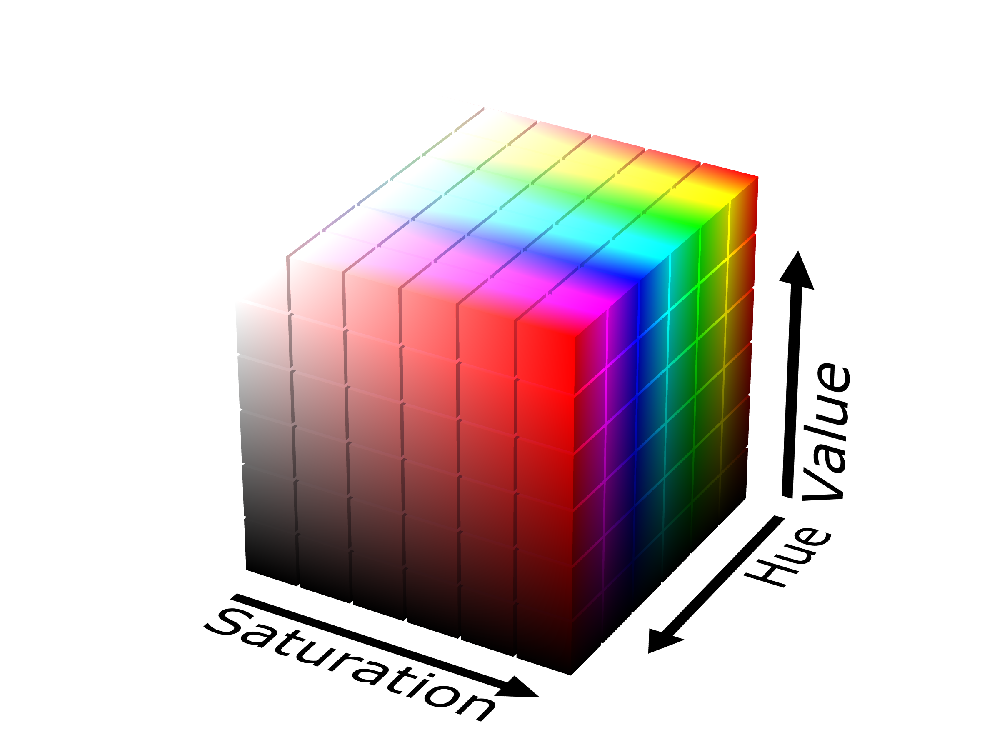

# 🖼️ HSV Picker GUI

A Gui for doing HSV filtering on images or camera feed

## 📦 Prerequisites

- Python 3.12.3 or higher

## 🚀 Getting Started

Before diving into the algorithms, make sure you have the required tools and libraries installed.

1. [Setup your development environment](./docs/setting_up_the_environment.md).
2. Run the command to start the GUI:

Use the run script to start the GUI:
```bash
./run.sh
```

Or run the following command directly:

```bash
streamlit run ./gui/main.py --server.port 8502
```


3. Open the link in your browser: [http://localhost:8502/](http://localhost:8502/)

## 🎨 Understanding HSV



- **H (Hue)** — *which* color it is, as an angle on the color wheel (OpenCV range `0–179`, i.e. degrees ÷ 2: 0=red, 60=green, 120=blue).
- **S (Saturation)** — *how vivid* the color is, from gray to pure (`0–255`; low = washed out/pastel, high = intense).
- **V (Value)** — *how bright* it is, from black to fully lit (`0–255`; low = dark, high = bright).

**How they interact:** the three are independent numbers, but at the extremes some override the others — if **V** is 0 the pixel is black no matter its H or S, and if **S** is 0 the pixel is a shade of gray so its **H** no longer matters. Only when both S and V are high does the **H** color show clearly.
